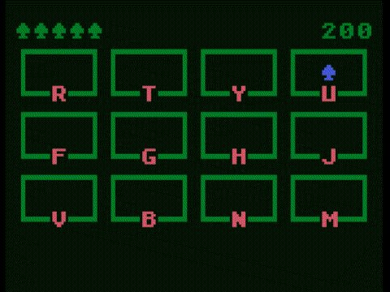

# BONK'EM - BASIC 10Liner Contest 2024
This game is my entry for the [13th Edition of the BASIC 10Liner Contest](https://gkanold.wixsite.com/homeputerium/copy-of-rules).

It is intended for the "PUR-120" category, written in stock Atari BASIC.



## How to run the game
The .atr disk image should be loaded into `D1:`, and contains an `AUTORUN.SYS` to launch the BASIC program automatically. Any emulator, such as Altirra, Atari800, etc. should be fine as long as it has BASIC enabled.

If the game does not automatically start, it can be started directly from BASIC by entering:
```basic
RUN"D:BONKEM.BAS"
```

## How to play
- Press `RETURN` to begin
- When the mole pops up, hit the corresponding key on your keyboard to bonk 'em
- The speed will gradually increase
- After you miss 5 moles, the game is over

---

# The source code
```basic
1DIM H(11,1):FOR I=0TO11:READ C:H(I,0)=C:READ C:H(I,1)=C:NEXT I:O=57344:QP=(PEEK(106)-8):Q=QP*256:POKE764,255
2FOR I=0TO999:POKE Q+I,PEEK(O+I):NEXT I:FOR I=0TO6:READ S:FOR L=0TO7:POKE Q+8*(8+I)+L,PEEK(Q+S*8+L):NEXT L:NEXT I
3GR.18:SE.0,12,6:POS.6,4:?#6;"BONK'EM":POS.3,9:?#6;"noah burney'24":FOR W=0TO999:ONPEEK(764)=12 GOTO4:NEXTW:GOTO3
4POKE756,QP:L=5:B=0:V=300:POS.0,0:?#6;".....":POS.19,0:?#6;0:FORR=0TO2:POS.0,1+3*R:SE.1,8,6:SE.2,4,9:SE.4,12,0
5?#6;"(---)(---)(---)(---)";:?#6;",   ,,   ,,   ,,   ,";:FOR C=0TO3:?#6;"*-";CHR$(H(R*4+C,0));"-+";:NEXT C:NEXT R
6M=INT(12*RND(1)):R=INT(M/4):C=M-R*4:X=2+5*C:Y=2+3*R:POS.X,Y:?#6;CHR$(14):POKE 764,255:T=V:V=V-5:IFV<50THENV=50
7POS.X,Y:HIT=(PEEK(764)=H(M,1)):ON HIT GOTO 9:T=T-1:ON T=0 GOTO 8:GOTO 7
8COL.3:?#6;"."; :L=L-1:D=(L=0):POS.L,0:?#6;" ";:ON D GOTO 3:FOR W=0TO200:NEXT W:POS.X,Y:?#6;" ";:GOTO 6
9?#6;CHR$(127);:B=B+1:PL=1+(B>9)+(B>99)+(B>999):POS.19-PL,0:?#6;B;:FOR W=0TO99:NEXT W:POS.X,Y:?#6;" ";:GOTO 6
10D.210,40,212,45,217,43,213,11,198,56,199,61,200,57,202,1,214,16,194,21,206,35,205,37,81,69,90,67,124,82,123
```
